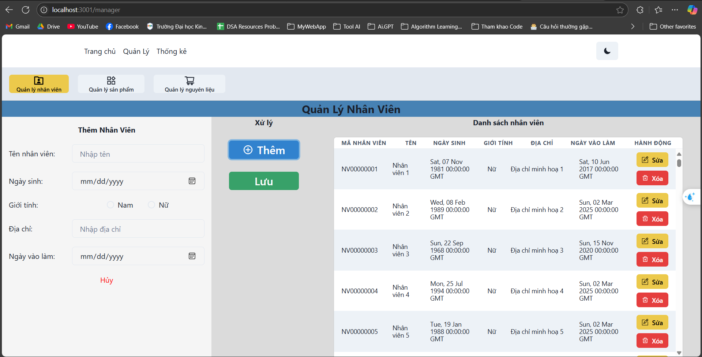
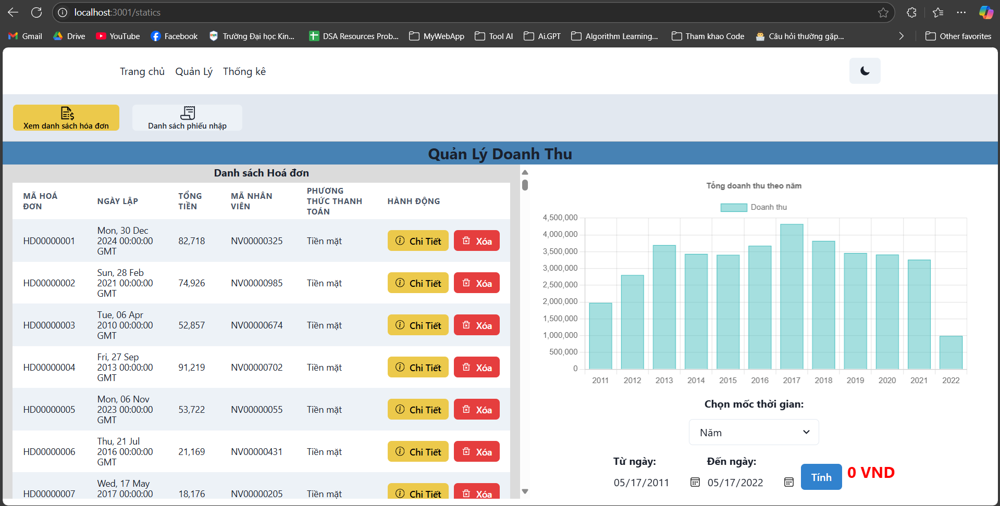

# QTRi CSDL

Build with Python(Flask) and JavaScript(React)

## Git Diagram


## Screenshots

### HomePage

<table width="100%">
  <tbody>
    <tr>
      <td width="1%"></td>
      <td width="1%"></td>
      <td width="1%"></td>
      <td width="1%"></td>
    </tr>
  </tbody>
</table>

### Management Page

<table width="100%">
  <tbody>
    <tr>
        <td width="1%"></td>
        <td width="1%"></td>
        <td width="1%"></td>
        <td width="1%"></td>
        <td width="1%"></td>
    </tr>
    <tr>
        <td width="1%"></td>
        <td width="1%"></td>
    </tr>
  </tbody>
</table>

### Static Page

<table width="100%">
  <tbody>
    <tr>
        <td width="1%"></td>
        <td width="1%"></td>
    </tr>
  </tbody>
</table>


### Run the App Locally

1. Clone the repository:

```bash
git clone https://github.com/Doanh-Dinh-7/48K142.07-QuanLyBanHang-Code.git
```

2. Navigate to the project directory:

```bash
cd 48K142.07-QuanLyBanHang-Code
```

3. Navigate to the backend directory:

```bash
cd backend
```

4. Create a virtual environment:

-   On macOS and Linux:

```bash
python3 -m venv venv
```

-   On Windows:

```bash
python -m venv venv
```

5. Activate the virtual environment:

-   On macOS and Linux:

```bash
source venv/bin/activate
```

-   On Windows:

```bash
venv\Scripts\activate
```

6. Install the dependencies:

-   On macOS and Linux:

```bash
pip3 install -r requirements.txt
```

-   On Windows:

```bash
pip install -r requirements.txt
```

7. Navigate to the frontend directory:

```bash
cd ../frontend
```

8. Install the dependencies:

```bash
npm install
```

9. Build the frontend:

```bash
npm run build
```

10. Navigate to the backend directory:

```bash
cd ../backend
```

11. Run the Flask app:

```bash
flask run 

#or
flask run --reload
```
